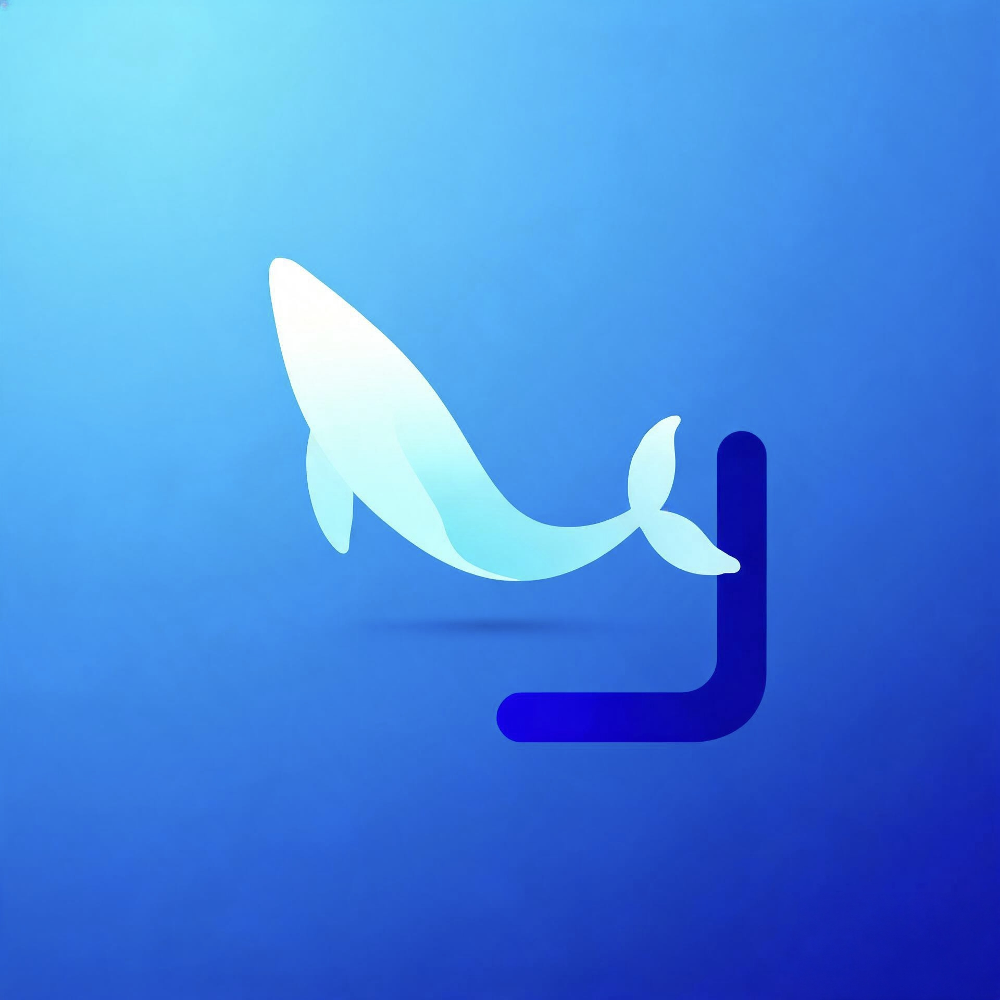
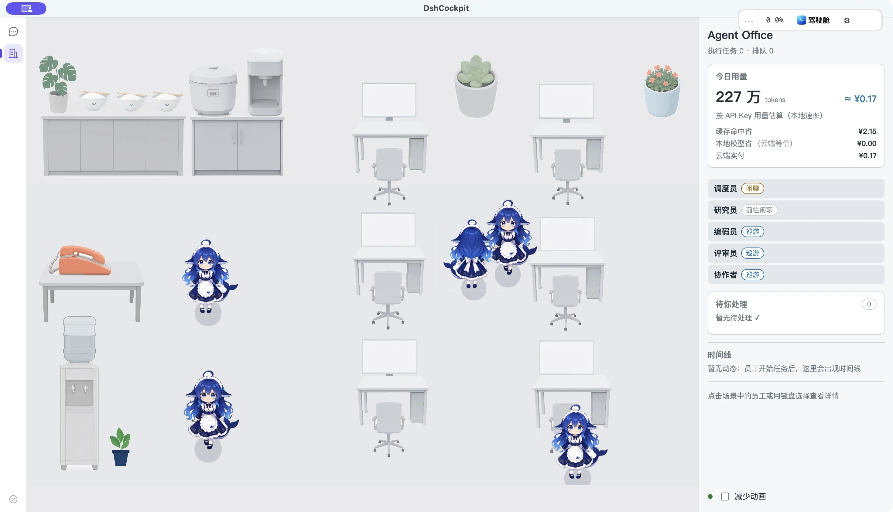
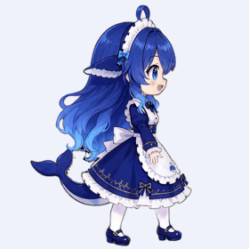

[简体中文](README.md) | **English**

<div align="center">


# DshCockpit · Whale Girl Office

**A little office. A lot of heart.**

A desktop home for your DeepSeek Harness agents.<br>
Watch your whale girl teammates work, wander, chat, and take a break.

[Download](https://github.com/Lxiayu/DshCockpit/releases) · [WeChat community](#wechat-community) · [Report an issue](https://github.com/Lxiayu/DshCockpit/issues)



*Captured from the application. Usage figures are local values at the time of recording, not cost or performance promises.*
</div>

## Give your AI team a place to work

DshCockpit is an open-source desktop shell for [DeepSeek Harness](https://github.com/deepseek-ai/deepseek-harness). It combines the native conversation workspace, resident desktop tools, and a virtual office that makes agent activity visible.

Meet the dispatcher, researcher, coder, reviewer, and collaborator. Their task states reflect runtime activity. Between tasks, characters can wander, chat, rest, and bring a little life to your desktop.

- **See your team:** characters, desks, walking animations, and speech bubbles.
- **Follow progress:** staff status, activity timelines, and daily work records.
- **Know when to help:** a pending-action area for questions and approvals.
- **Keep track of usage:** daily tokens and estimated costs, with detailed controls in the cockpit.
- **Return to the conversation:** switch between the office and native Harness workspace from the left rail.

Task facts and ambient behavior are separate. Running, completed, and failed states come from the runtime. Wandering and resting are local office behavior; animation alone never means a task has completed.

## Meet your little teammate

<div align="center">


**“I'll take this one.” · “Lunch first.” · “Done!”**



[Watch the 12-second office recording](photo/office-real.mp4)
</div>

The recording shows actual wandering and conversation in the app. The character pictures and GIF are asset previews, not recordings of task execution. Agents and their visual characters remain separate in the implementation.

## Desktop tools behind the characters

| Capability | What it provides |
| --- | --- |
| Native Harness workspace | Familiar conversations and tools, with desktop features around them |
| Bundled runtime | No separate Node.js installation needed for release packages |
| Updates and rollback | Runtime checks, switching, and data snapshots |
| Cost and context visibility | Token usage, context pressure, cost summaries, and budget reminders |
| Quick Ask and scheduled tasks | Background work and completion notifications |
| Search and remote access | Session search and optional phone/message-channel access |

Check the release notes for the capabilities in your downloaded version. The office is actively evolving, and feedback on character behavior and interactions is welcome.

## Get started

1. Download a package from [Releases](https://github.com/Lxiayu/DshCockpit/releases).
2. Install and launch DshCockpit, configure your model/API key, and choose a workspace.
3. Give the agent a task in the conversation workspace, then select **Office** in the left rail.
4. Follow staff status, the timeline, and pending actions; return to the conversation when needed.

| Platform | Package |
| --- | --- |
| Windows x64 | `.exe` installer, or portable `.zip` |
| macOS Apple Silicon | `.dmg`; drag the app into Applications |

Current release builds target Windows x64 and macOS arm64. The arm64 package is not for Intel Macs. macOS builds use ad-hoc signing and are not Apple Developer ID notarized; first launch may require approval in System Settings.

### First launch on macOS

Open the `.dmg` and drag **DshCockpit** into Applications. If macOS reports that the app is damaged or the developer cannot be verified, first confirm that the installer came from this project's release channel, then run in Terminal:

```bash
xattr -dr com.apple.quarantine /Applications/DshCockpit.app
```

Reopen the app from Applications. This removes the quarantine attribute from this app only; adjust the path if you installed it elsewhere. See the [v0.2.8 installation notes](https://github.com/Lxiayu/DshCockpit/releases/tag/v0.2.8). Choose `.dmg` for normal installation; the macOS `.zip` is primarily for automatic updates.

## WeChat community

Share your office moments, ask questions, and help improve the app.

<div align="center">

</div>

This image is marked valid **before October 3, 2026**. If it has expired, contact us through [GitHub Issues](https://github.com/Lxiayu/DshCockpit/issues) for an updated code.

## Run from source

Use Node.js 22 or later and npm:

```bash
git clone https://github.com/Lxiayu/DshCockpit.git
cd DshCockpit
npm install
npm start
```

Package with `npm run build:win` or `npm run build:mac`. See [RELEASE.md](RELEASE.md) and `.github/workflows/` for build requirements.

## Contribute

Bug reports, interaction ideas, documentation, character animation, and code contributions are welcome. Include the app version, operating system, and reproduction steps. Remove private task content before sharing screenshots or recordings.

- `src/office/`: office runtime, rendering, and interactions.
- `content/` and `resources/characters/`: content and character assets.
- `src/`: desktop shell and runtime integration.
- `photo/`: README and promotional assets.

See [DESIGN.md](DESIGN.md) and [总纲.md](总纲.md) for architecture and design background. Historical plans do not promise currently released features.

## License and assets

Core code is [MIT licensed](LICENSE). Logos, characters, illustrations, and third-party artwork do not automatically inherit the code license. Consult their source and license information before reuse. See [photo/README.md](photo/README.md) for the promotional asset index.

DshCockpit is a community project, not affiliated with or endorsed by DeepSeek.
